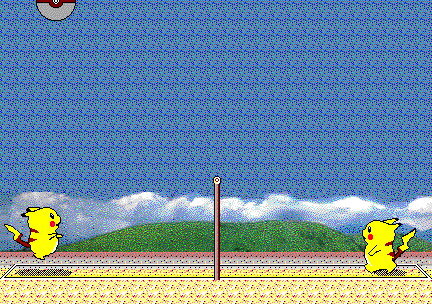

# gym-pikachu-volleyball


A [Gymnasium](https://gymnasium.farama.org/) environment for the classic browser game [Pikachu Volleyball](https://gorisanson.github.io/pikachu-volleyball/en/), built for reinforcement learning research.

Based on the original [gym-pikachu-volleyball](https://github.com/HoseongLee/gym-pikachu-volleyball) by HoseongLee, with the following changes:
- Migrated from `gym` to `gymnasium`
- Redesigned `step()` API to support single-agent and two-player / self-play
- Symmetric background rendering
- Built-in computer AI fallback per player

Pikachu Volleyball (対戦ぴかちゅ～　ﾋﾞｰﾁﾊﾞﾚｰ編) is a Windows game developed by "(C) SACHI SOFT / SAWAYAKAN Programmers" and "(C) Satoshi Takenouchi" in 1997. The game logic is ported from a [reverse-engineered JavaScript version](https://github.com/gorisanson/pikachu-volleyball) by [gorisanson](https://github.com/gorisanson).

## Installation

```bash
pip install -e .
```

## Quick Start

```python
import gymnasium as gym
import gym_pikachu_volleyball

env = gym.make("PikachuVolleyball-v0", render_mode="human", limited_timestep=3000)
obs, info = env.reset()

for _ in range(10000):
    action = env.action_space.sample()
    obs, reward, terminated, truncated, info = env.step(action)
    env.render()

    if terminated or truncated:
        obs, info = env.reset()

env.close()
```

## Environments

| ID | Observation | Notes |
|---|---|---|
| `PikachuVolleyball-v0` | State vector (10,) | Default |
| `PikachuVolleyballPixel-v0` | RGB frame (304, 432, 3) | Pixel-based observation |
| `PikachuVolleyballRandom-v0` | State vector (10,) | Randomized serve position and ball speed |

## Constructor Arguments

| Argument | Type | Description |
|---|---|---|
| `render_mode` | `str` | `"human"` to display a window, `"rgb_array"` for headless |
| `limited_timestep` | `int` | Max steps per episode before forced termination |

## Action Space

`Discrete(18)` — a combination of three independent inputs:

| Axis | Values |
|---|---|
| x-direction | `-1` left, `0` stay, `+1` right |
| y-direction | `-1` jump, `0` stay, `+1` duck |
| power hit | `0` normal, `1` power hit |

All 18 actions enumerate these combinations:

| Action | x | y | power |
|---|---|---|---|
| 0 | +1 | -1 | 0 |
| 1 | +1 | 0 | 0 |
| 2 | +1 | +1 | 0 |
| 3 | +1 | -1 | 1 |
| 4 | +1 | 0 | 1 |
| 5 | +1 | +1 | 1 |
| 6 | 0 | -1 | 0 |
| 7 | 0 | 0 | 0 |
| 8 | 0 | +1 | 0 |
| 9 | 0 | -1 | 1 |
| 10 | 0 | 0 | 1 |
| 11 | 0 | +1 | 1 |
| 12 | -1 | -1 | 0 |
| 13 | -1 | 0 | 0 |
| 14 | -1 | +1 | 0 |
| 15 | -1 | -1 | 1 |
| 16 | -1 | 0 | 1 |
| 17 | -1 | +1 | 1 |

> Actions are defined from **player 1's perspective** (left side). Player 2's actions use the same indices but x-direction is automatically mirrored internally.

## Observation Space

### State mode (`PikachuVolleyball-v0`, `PikachuVolleyballRandom-v0`)

`Box(-inf, inf, shape=(10,), dtype=float32)`

| Index | Description |
|---|---|
| 0 | Player 1 x position |
| 1 | Player 1 y position |
| 2 | Player 1 y velocity |
| 3 | Player 2 x position |
| 4 | Player 2 y position |
| 5 | Player 2 y velocity |
| 6 | Ball x position |
| 7 | Ball y position |
| 8 | Ball x velocity |
| 9 | Ball y velocity |

Coordinates: x increases left-to-right (screen width = 432), y increases downward (screen height = 304). Players start at x=36 (P1) and x=396 (P2).

### Pixel mode (`PikachuVolleyballPixel-v0`)

`Box(0, 255, shape=(304, 432, 3), dtype=uint8)` — raw RGB frame.

### `info["other_obs"]`

Every `step()` and `reset()` includes `info["other_obs"]`: the same state from **player 2's perspective**, useful for self-play training.

- State mode: x coordinates are mirrored (`432 - x`), x velocity is negated, players are swapped so index 0–2 is always "self"
- Pixel mode: the frame is horizontally flipped

Both `obs` and `info["other_obs"]` present the player's own side as the **left side**, so a single policy can be used for both players.

## Reward

Reward is only non-zero when the episode ends (`terminated=True`):

| Condition | Reward |
|---|---|
| Ball lands on player 2's side | `+1` |
| Ball lands on player 1's side | `-1` |
| Timeout (`limited_timestep` reached) | `-1` |

Reward is always from **player 1's perspective**. When training player 2, negate the reward.

## Two-Player and Self-Play

`step()` accepts either a single action or a tuple `(p1_action, p2_action)`. Either value can be `None` to fall back to the built-in computer AI for that player.

```python
# Player 1 = agent, player 2 = built-in AI
env.step(p1_action)

# Both players = agents
env.step((p1_action, p2_action))

# Player 1 = built-in AI, player 2 = agent
env.step((None, p2_action))

# Both = built-in AI (useful for testing/rendering)
env.step((None, None))
```

Typical self-play loop:

```python
obs, info = env.reset()

while True:
    p1_action = policy(obs)
    p2_action = policy(info["other_obs"])

    obs, reward, terminated, truncated, info = env.step((p1_action, p2_action))
    p2_reward = -reward

    if terminated or truncated:
        obs, info = env.reset()
```

## Reset Options

```python
# Serve side is automatically decided based on the last rally result
obs, info = env.reset()

# Force a specific serve side
obs, info = env.reset(options={"is_player2_serve": True})
obs, info = env.reset(options={"is_player2_serve": False})
```
